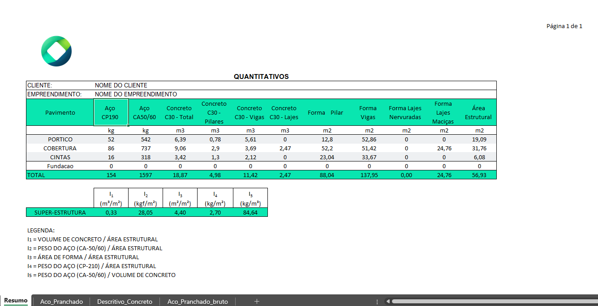
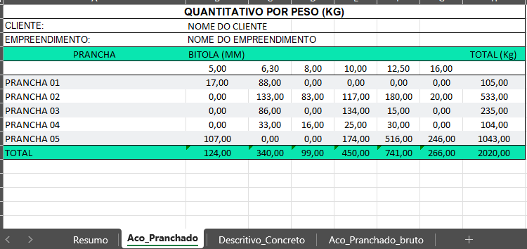
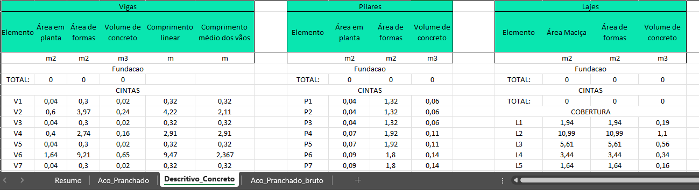
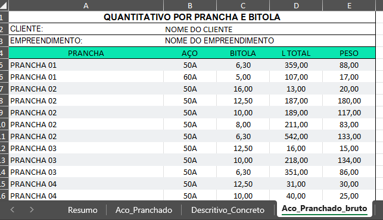

# Extrator de Quantitativos TQS

O **Extrator de Quantitativos TQS** é uma ferramenta desenvolvida para auxiliar engenheiros estruturais na extração manual de quantitativos do programa TQS e exportar esses quantitativos estruturais para Excel. Atualmente, a ferramenta permite a extração de dados de edifícios de Concreto Armado e de Parede de Concreto.

O programa foi criado em **C#** usando **.NET 7.0**. Para utilizar o programa é necessário instalar o .NET 7.0, disponível nesse [link](https://dotnet.microsoft.com/pt-br/download/dotnet/thank-you/sdk-7.0.410-windows-x64-installer)

_Tela de resumo geral_

_Tela de resumo de aço_

_Quantitativo de concreto descritivo_

_Quantitativo de aço descritivo_

## Modo de Uso

1. Abra o arquivo `Quant_Tqs.exe`.
2. Selecione a pasta do projeto.
3. O quantitativo será salvo na pasta raiz do programa.

## Funcionalidades Futuras

1. Extração de dados de edifícios em alvenaria estrutural.
2. Exportação de dados diretamente em PDF.
3. Interface para configuração de cores e logotipo da empresa.
